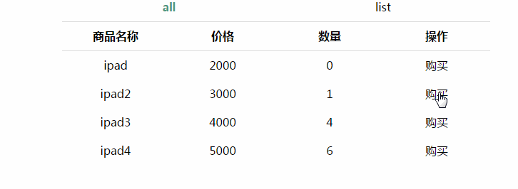

# react + redux的入门级demo


### 概述

初步熟悉react 和 redux 的一个demo

简单的一个商品列表和加入购物车，从购物车删除等功能

redux相关的内容我都放在store 的目录里面，因为比较熟悉vue，所以也按vue的思路去创建目录

构建工具使用webpack

### demo展示



### 运行

```
//默认是 localhost:8081  可以在package.json 文件修改 
npm i && npm run dev

//上线

npm run build

```